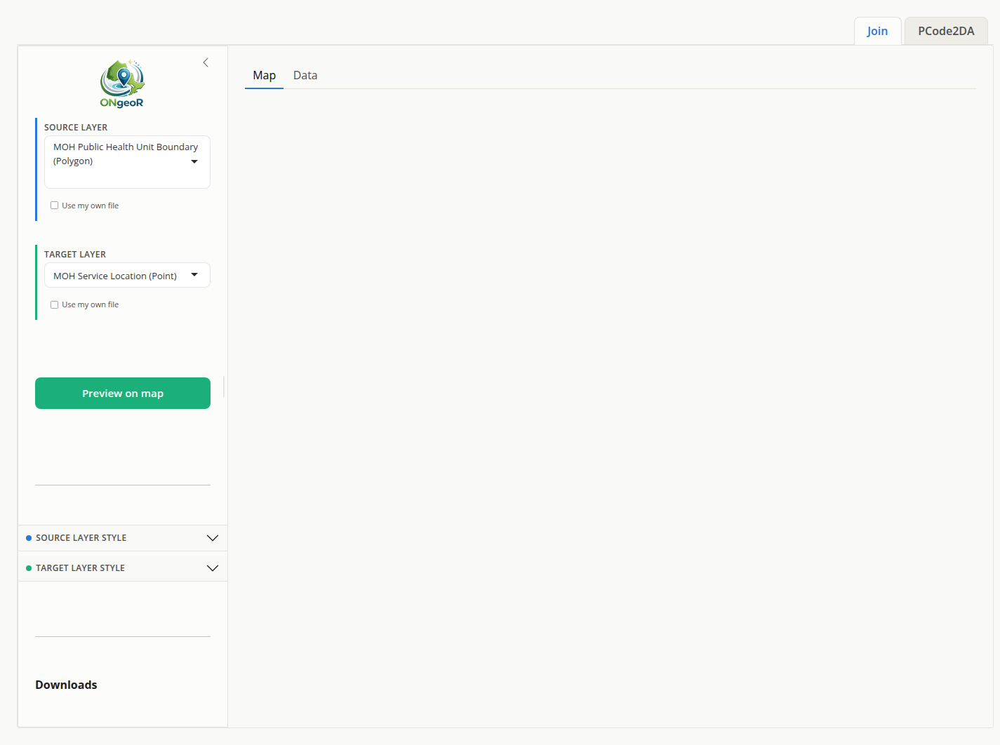
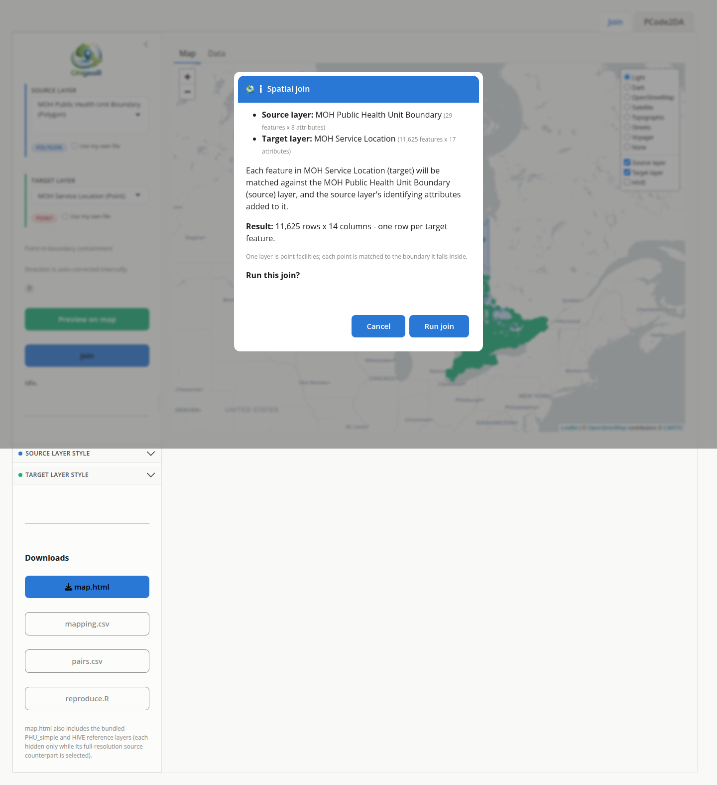
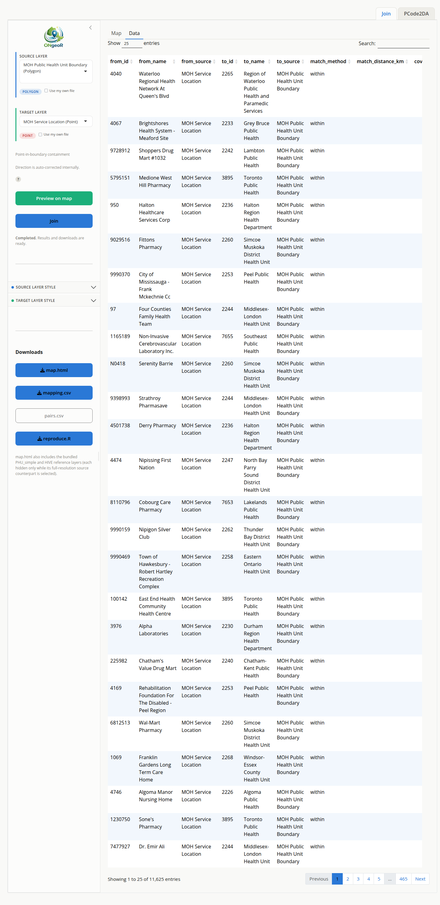

```{r setup, include=FALSE}
knitr::opts_chunk$set(collapse = TRUE, comment = "#>")
```

ONgeoRapp is a browser-based Shiny application over ONgeoR that lets you build
spatial crosswalks and run nearest-match searches without writing any R code.
This vignette describes how to launch the app and use it.

## Launching the app

Open a browser-based session with a single call:

```{r launch, eval=FALSE}
ONgeoRapp::run_app()
```

`run_app()` calls `shiny::runApp()` on the bundled app directory
(`inst/shiny`). By default Shiny opens a browser tab automatically. You can
pass additional arguments to control the port or host:

```{r launch-port, eval=FALSE}
ONgeoRapp::run_app(port = 4321, launch.browser = FALSE)
```

The app requires the `shiny` and `bslib` packages; `run_app()` checks for them
at startup and prompts you to install them if they are missing.

## Building a link

```{r screenshot-link-tab, echo=FALSE, out.width="100%", fig.cap="The app at startup. Source and Target layer pickers are set to their defaults; the Join button is greyed out until a preview succeeds."}

```

The app does one thing: it retrieves two registered Ontario GeoHub or LIO
layers and joins them spatially. There is no top-level navigation, because
there is only one view to navigate to — the sidebar holds the controls and the
Map/Data tabs hold the two views of the result.

There is no match-rule control. Once you have picked a Source layer and a
Target layer, the operation is fully determined by their geometry types, so
there is nothing left to choose. Two polygon layers produce an intersection;
two point layers produce a nearest match; a point and a polygon produce
containment; anything involving a raster produces sampling. The `?` link beside
the layer pickers shows the full nine-cell matrix.

Workflow:

1. **Source layer** -- Select a source from the "Source layer" dropdown. This
   is the layer whose identifying attributes get attached to the result (e.g.
   Public Health Unit boundaries).
2. **Target layer** -- Select a second source from the "Target layer" dropdown
   (e.g. MOH Service Locations). The result is shaped like this layer: one row
   per target feature.
3. **Preview on map** -- Click **Preview on map** to retrieve both layers and
   draw them on an interactive Leaflet map. Inspect the map to confirm the
   layers align as expected before joining. **Join stays greyed out until a
   preview succeeds** for the currently selected pair, and re-greys if you
   change either dropdown.

```{r screenshot-preview-map, echo=FALSE, out.width="100%", fig.cap="After a successful preview: both layers are drawn on the map and the Join button is enabled (blue)."}
knitr::include_graphics("../man/figures/app-preview-map.png")
```

4. **Join** -- Click **Join** to open a confirmation that names both layers
   with their dimensions and states the expected result shape. Nothing is
   retrieved or computed until you confirm.

```{r screenshot-join-confirm, echo=FALSE, out.width="100%", fig.cap="The Join confirmation modal: layer names, feature counts, column counts, expected result shape, and the 'Run join' button."}

```

Two point layers are joined the same way, on this same tab: each target point
is matched to its single nearest source point, and the map draws connector
lines between the pairs. There is no `k` and no distance cap, because a nearest
match is what the geometry pair already implies.

The direction is fixed: the result is shaped like the Target layer, one row per
target feature.

## Uploading postal codes as a target layer

The Target layer picker includes an "Upload postal codes" option at the end of
the Points group. When selected, the sidebar offers a file browser accepting
`.csv`, `.xlsx`, and `.xls` files. After uploading, the app scans every column
for values matching the Canadian postal code format (`A1A 1A1`) after
normalization and selects the best match (>= 80% of non-missing values). A
dropdown lists all columns so you can override the detection.

Once a column is selected, the codes are resolved to point coordinates via
`ONgeoR::resolve_postal_points()`. The status area below the column picker
reports how many input rows were placed and how many were unmatched. Points
resolved through Geonames carry place-level coordinates rather than
address-level coordinates; in rural areas these can be kilometres off, and the
status area flags this when it applies.

The resolved point layer is then used as the target for spatial linking,
exactly as if a registered point source had been selected. No additional
configuration is needed.

## Two result tables

```{r screenshot-data-tab, echo=FALSE, out.width="100%", fig.cap="The Data sub-tab after a successful join: one row per target feature, with source attributes prefixed src_ and target attributes prefixed tgt_."}

```

A polygon-to-polygon join produces two views of one computation, and both are
downloadable:

- The **pair table** (`pairs.csv`) has one row per overlapping pair, each with
  an `interaction_id`, and is the one you join other data onto.
- The **target table** (`mapping.csv`) has exactly one row per target feature,
  with the matched sources collapsed into `;`-delimited columns. It is easier
  to read but cannot be joined on.

Both carry every attribute from both input layers, prefixed `src_` and `tgt_`
so that a `NAME` column on one layer cannot overwrite a `NAME` column on the
other.

## Download buttons

The download buttons become available as the underlying result appears.

| Button | Output |
|---|---|
| **Download map** | `map.html` -- the Leaflet map as a standalone HTML file |
| **Download results** | `mapping.csv` -- one row per target feature (or `linked.csv` for raster linking) |
| **Download pairs** | `pairs.csv` -- one row per matched pair |
| **Download script** | `reproduce.R` -- an R script that reproduces the result from scratch |

The `map.html` file embeds the widget's JavaScript and data, so it opens
without R installed; note the basemap tiles are still fetched from the tile
provider, so viewing it requires network access.

## A note on automated testing

The source picker dropdowns use selectize.js, a JavaScript-enhanced widget
that wraps a standard HTML select element. When writing automated tests with
`shinytest2`, the underlying input value can be set programmatically:

```r
# Works: sets the underlying Shiny input value
app$set_inputs(base_layer = "phu_boundaries")
```

However, the visible selectize dropdown does not update its displayed text
until the JavaScript layer processes the change. Tests that rely on the widget
visually showing the selected value must follow the `set_inputs()` call with
either `app$click()` on a trigger element or direct JavaScript injection.

Note that `shinytest2` has no `app$execute_script()`. Use `app$run_js()` for
side effects and `app$get_js()` for values — and `get_js()` evaluates an
*expression*, so a `return` statement in it silently yields nothing.
`tools/take_screenshots.R` documents the working pattern, including the
`AppDriver$new(wait = FALSE)` needed because the app's `ExtendedTask` keeps
Shiny busy at startup.

Because of this constraint, the ONgeoRapp test suite covers the **server-side
logic** (retrieval, linking, nearest-match computation, and download
generation) in isolation rather than driving the full UI flow through a
headless browser. This is intentional: the spatial and data correctness
properties are best tested at the function level, while UI integration tests
would add fragility without exercising new logic paths.

If you want to add UI-level coverage, `shinytest2::AppDriver` is the
recommended approach. See `vignette("shinytest2", package = "shinytest2")` for
details on recording and replaying interactions with selectize widgets.
